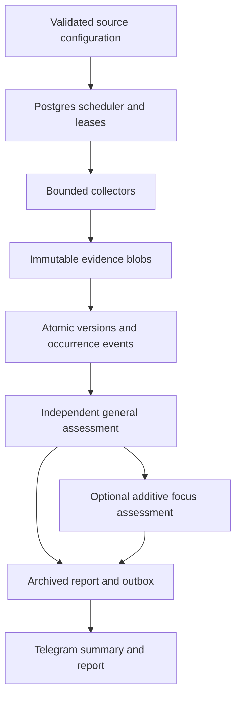

# Architecture and staged delivery

The supplied Protocol Intelligence Monitor project specification is the architectural authority, with the owner's later amendments below. This document records the initial implementation and remaining work; it does not mark the entire specification complete.

**The 9 September [prepublication review](PREPUBLICATION_REVIEW.md) supersedes the earlier pilot-readiness assessment.** First production is blocked. Stage labels below describe code presence only; no stage is accepted until its requirements have verification evidence in [RELEASE_REQUIREMENTS.yaml](RELEASE_REQUIREMENTS.yaml).

Specification fingerprint: `c457a193bb9521408f50578c21488a65590970b1d6ea9af638143d93fd14bfd8`.

## Accepted amendments

1. Broad importance and novelty assessment is the default for every protocol; a thesis file is optional.
2. Collection and general analysis must not be narrowed by optional watch objectives.
3. Optional focus runs as a separate additive pass. General inputs and prior general context exclude focus questions/results.
4. Telegram is the initial output channel. GitHub Issues are an optional later destination.
5. Name-only onboarding is available through an assistant with repository access; it produces verified source configuration. New adapters still require code when a surface is not supported.

## Core data flow

Postgres owns scheduling, subscriptions, events, analysis jobs, and delivery state. Evidence blobs are addressed by content hash and written before the database makes an event eligible. Baseline, unchanged, changed, failed-to-check, and stale outcomes are distinct. Every occurrence has its own sequence even when an old/new hash pair repeats.

Collectors use expiring token leases and short commit transactions. Per-origin permits and spacing are coordinated in Postgres so separate worker processes share the same limits. Expired completions cannot advance source state, chunk state, or reports. HTTP requests, object-store I/O, and model calls occur outside the main write transactions.

Source identity includes the acquisition/extraction policy and URL; compatible subscriptions share one fetch stream. Each subscription records its starting sequence. New protocols do not receive old shared-source alerts. New sources have an explicit silent first observation, including sources discovered after initial setup.

## Analysis and evidence

The initial mode is always-deep. Every eligible real change reaches general analysis without a keyword or size threshold. The first unprocessed event anchors a fixed cluster window. Eligible events are linked to a single general job per protocol under a lock; later changes remain pending for future clusters.

Model jobs freeze protocol context, coverage, prior general inferences, model, effort, prompt version, and chunk limits. Every diff character is retained across chunks. Results and input hashes are checkpointed, so retries can reuse completed chunks. A cross-chunk pass can add findings but cannot erase earlier findings. Oversized work fails visibly while preserving its evidence; it is not silently truncated or labeled unimportant.

Model responses use a strict schema and can cite only supplied event IDs. Source text and prior conclusions are explicitly untrusted evidence, with no tools available to the analysis model. Reports separate observation, significance, and uncertainty and include exact diffs and historical hashes. The initial report format is intentionally smaller than the specification's full research-report template; richer context retrieval and report fields remain later work.

Material findings (MEDIUM/HIGH/CRITICAL) produce an outbox summary and Markdown document. A focus result has its own report and can only add alerts. Notification state is independent of collection and analysis: delivery failure never removes evidence or a completed report.

Telegram provides no client idempotency key for sends. The outbox records acknowledged message IDs, retries definite failures, and parks ambiguous submissions as UNKNOWN for operator reconciliation. Attachments wait for their summary to be acknowledged.

## Staged implementation plan

| Stage | Scope | Initial release status / next acceptance gate |
| --- | --- | --- |
| M0 | Repository, packaging, validation, CI | Implemented; CI must pass unit, real Postgres, and container checks |
| M1 | Config, baselines, exact evidence transitions | Implemented for page/JSON/sitemap adapters; one-line and repeated transitions covered by tests |
| M2 | Postgres lifecycle, blob backends, worker roles | Implemented pilot; live storage setup and backup/restore exercise required |
| M3 | Sitemap/docs discovery, Markdown preference, failure handling | Implemented; baseline starter protocols in owner's runtime and inspect coverage |
| M4 | GitHub full-history and full frontend assets | Pending; add commit pagination, force-push/rewrite handling, immutable asset bodies, adapter fixtures |
| M5 | Rich historical evidence context and retrieval | Partial: exact version/diff history and recent general reports exist; broader contextual retrieval and evidence ledger pending |
| M6 | Broad model analysis and optional additive focus | Implemented; verify model access and assess pilot alert quality with real retained changes |
| M7 | Telegram and operations | Core output/setup/reconciliation implemented; digests, automatic health alerts, richer operator tooling pending |
| M8 | Production pilot | Await owner-controlled runtime credentials; baseline, no-change run, controlled real-change validation, restore drill |
| M9 | 200–500 protocol qualification | Pending load/soak tests, query/queue profiling, rate-limit tuning, retention policy, and source coverage review |

## Open requirements, not accepted limitations

The items below map to the release register. GitHub/asset coverage (PROD-02/03), clean baselines and new-page context (PROD-06), polling reconciliation (PROD-07), storage/restore (PROD-05), delivery (PROD-09), and runtime networking (PROD-10) block first production. Historical retrieval, report format, digest, retention and scale remain open under the corresponding SPEC/SCALE gates. Listing an item here does not close it.

- Source discovery is configured/assistant-assisted. The shipped footprint is not a complete inventory of either starter protocol.
- HTML extraction preserves visible text, link targets, script identities and embedded JSON, but does not download and semantically inspect all JavaScript/CSS/source-map bodies. Dynamic client-rendered content can therefore be outside current coverage.
- New sitemap pages baseline silently. Inventory additions are change evidence; full context attachment from a new page to the inventory event is a later enrichment feature.
- DNS/public-address and redirect-scope checks are present; DNS resolution is not pinned to the subsequent HTTP transport connection. Keep configuration restricted to reviewed public sources and use outbound network controls in a larger deployment.
- Shared source cadence does not yet relax when the fastest subscriber is removed. Sitemap removals retain page polling. Retirement/reconciliation policies need implementation.
- The general model receives recent material general reports as prior inferences, not a complete historical reasoning ledger. Focus cannot enter that context through the automatic path, but operators must also keep neutral profiles free of narrow watch instructions.
- All evidence is retained initially. Add tested retention/backup policies before volume grows. S3/R2 compatibility and Telegram/OpenAI account access require live credentialed verification.
- There is no dashboard, Issues integration, daily digest, full review/replay UI, or guaranteed exactly-once Telegram delivery. The CLI exposes source, analysis, and delivery failures.

## Validation strategy

Unit tests replay HTTP and Telegram behavior without credentials. Postgres integration tests exercise migrations, baseline → unchanged → repeated changes, failure recovery, concurrent queue claims, expired worker fencing, general/focus independence, crash recovery, and delivery reconciliation. CI runs against a disposable Postgres service and builds/validates the production container.

Production acceptance additionally needs real baselines, provider integration checks, a later changed observation, operational monitoring, and restore validation. A successful CI run is evidence for the implementation's tested behavior, not proof of complete source coverage or production-scale readiness.
